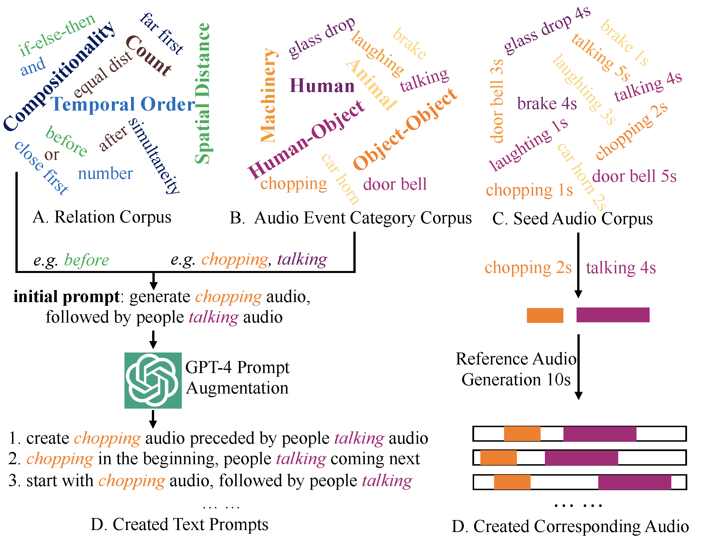

[](https://arxiv.org/abs/2412.15922)

## RiTTA: Modeling Event Relations in Text-to-Audio Generation

[Yuhang He<sup>1,2</sup>](https://yuhanghe01.github.io/),
[Yash Jain<sup>2</sup>](https://scholar.google.com/citations?user=Fr6QHDsAAAAJ&hl=en),
[Xubo Liu<sup>3</sup>](https://liuxubo717.github.io/),
[Andrew Markham<sup>1</sup>](https://www.cs.ox.ac.uk/people/andrew.markham/),
[Vibhav Vineet<sup>2</sup>](https://vibhav-vineet.github.io//)
<br>
1. Department of Computer Science, University of Oxford. Oxford. UK.
2. Microsoft Research.
3. Centre for Vision, Speech & Signal Processing, University of Surrey, UK.

**TL:DR**: We systematically benchmark audio events relation in Text-to-Audio generation by proposing:
 1. audio events relation corpus 
 2. audio event category corpus 
 3. seed audio event corpus 
 4. new audio events relation aware evaluation metrics 
 5. finetuning strategy for existing TTA models to boost their audio events relation modelling capability.

<a href="./"></a>
**RiTTA Motivation**: The acoustic world is rich with diverse audio events that exhibit various relationships. While text can precisely describe these relationships, current TTA models struggle to capture both the audio events and the relations conveyed by the text. This challenge motivates us to systematically study RiTTA.

### Audio Events Relation Corpus

We construct four main relations, each of which contains multiple sub-relations. In total, we have constructed 11 relations.

| Main Relation      | Sub-Relation                | Sample Text Prompt                                                         |
|--------------------|-----------------------------|----------------------------------------------------------------------------|
| Temporal Order     | before; after; simultaneity  | generate dog barking audio, followed by cat meowing                        |
| Spatial Distance   | close first; far first; equal dist. | generate dog barking audio that is 1 meter away, followed by another 5 meters away |
| Count              | count                        | produce 3 audios: dog barking, cat meowing and talking                     |
| Compositionality   | and; or; not; if-then-else   | create dog barking audio or cat meowing audio                              |

### Audio Events Category Corpus

We construct four main audio events categories that cover the commonly heard audio events in our daily life, each of which further corresponds to multiple sub-categories. For each category, we collect five seed exemplar audios from either [freesound.org](https://freesound.org/) or VCTK dataset [1] (just for the talking category). 

| Main Category              | Sub-Category                                                                 |
|----------------------------|------------------------------------------------------------------------------|
| Human Audio                | baby crying; talking; laughing; coughing; whistling                          |
| Animal Audio               | cat meowing; bird chirping; dog barking; rooster crowing; sheep bleating      |
| Machinery                  | boat horn; car horn; door bell; paper shredder; telephone ring               |
| Human-Object Interaction   | vegetable chopping; door slam; footstep; keyboard typing; toilet flush        |
| Object-Object Interaction  | emergent brake; glass drop; hammer nailing; key jingling; wood sawing        |

### Text-Audio Pair Generation Strategy

We maximise the text-audio pair generation diversity by:

1. adopting GPT-4 to augment the text description so that the same relation can be expressed by multiple vibrant texts.
2. disentangling relation text description and audio events so that the same relation can be associated with arbitrary audio events.
3. diversifying the final audio generation from selected audio events.

<!-- { style="display: block; margin: 0 auto;" } -->
<div style="text-align: center;">
  
</div>

<figcaption align="center">Fig 2: Text-Audio pair generation pipeline.</figcaption>

### Relation Aware Evaluation

For any TTA model generated audio, we first apply audio events detection model (in our case, we use PANNS [2]) to detect all potential audio events. Each detected audio event has the meta data: start/end time, semantic class, confidence score. Based on the detected audio events, we adopt a multi-stage relation aware evaluation framework to evaluate how accurate the pre-specified relation is incorporated in the audio.

* **Presence Score**, which checks whether the pre-specified audio events are detected in the generated audio.
* **Relation Correctness Score**, which further checks if the pre-specified relation is correctly modelled in the generated audio.
* **Parsimony Score**, which checks the redundancy in the generated audio, unnecessary and excessive audio events lead to lower parsimony score.

Finally, averaging across all relations gets average-(Presence/Relation Correctness/Parsimony) score, further averaging across multiple audio events confidence scores gets mean average (mA-) Presence/Relation Correctness/Parsimony score. Multiplying the three mA- scores gives us the final multi-stage relation aware score **mAMSR**.

### Code Detail Explanation

#### 1. Text-Audio pair data generation

```python
python main_gen_TTA_data.py
```

You need to edit `tta_datagen_config.yaml` to specify the data generation configuration.

#### 2. Evaluation

Evaluation data is stored in `eval_data.pkl`, which contains about 8000 text prompts, where each relation has $720$ text prompts. The corresponding reference audio (together with panns, vggish embedding) is accessible via [GoogleDrive](https://drive.google.com/file/d/1hYZCyJ-Aq1fARCbFXbU874GN8EoxY8Fq/view?usp=sharing).

```python
import pickle

eval_data = pickle.load( open('eval_data.pkl', 'rb') )
#eval_data['Count']['count'] or other entries.
print(eval_data['Count']['count'][100:115])
"""
1. create 2 audio clips, including footstep and keyboard typing.
2. generate 4 audio, among them are laughing, baby crying, whistling and coughing.
...
"""
print(eval_data['Count']['count'][100:115])
"""
1. if generated bird chirping audio, then continue to generate telephone ring audio else to generate toilet flush audio.
2. generate dog barking audio if generated vegetable chopping audio else just generate coughing audio.
...
"""
```

```python
#in folder evaluation
#relation aware eval.
python main_gen_TTA_data.py
#general eval.
python main_extract_embed.py
python KL_score.py
python FD_score.py
python FAD_score.py
```

#### 3. Audio Event Detection Model Finetune

To compute the relation aware evaluation score (see [section](#relation-aware-evaluation)), we first need to call audio event detection model to detect all potential audio events in a generated audio. The finetuned audio event detection model can be downloaded through the [GoogleDrive](https://drive.google.com/file/d/12L1UBeLPV2JkDSAGQ-zqgKeQGBObbCtP/view?usp=sharing). We also provide the finetuing code in directory [finetune_panns](./finetune_panns).

```python
#in folder finetune_panns
python main_finetune_panns.py
```

### 4. Tango Fintuning on RiTTA Data

1. We finetune Tango [3] with 44 hours our generated text-audio relation training set (call [main_gen_TTA_data.py](./main_gen_TTA_data.py) with random seed 200 in [tta_datagen_config.yaml](./tta_datagen_config.yaml) to generate the training set). We use Adam optimizer with a learning rate of $3\times10^{-5}$, batch size of $16$, SNR gamma value of $5$. The training was performed for 40 epochs on 4 A100 GPUs. The finetuned model can be downloaded through the [GoogleDrive](https://drive.google.com/drive/folders/1Fpdiyp1tPQ-DrYp9sIB6adKZo9tgeLXo?usp=sharing).

2. How to run the inference with the finetuned model?

   * Set up the Tango environment by following [Tango Github](https://github.com/declare-lab/tango).
   * Edit `inference_finetune.sh` to specify the finetuned model, edit `inference_finetune.py` function `get_all_data()` to specify the text prompts.
   * run `bash inference_finetune.sh` to get the inference result.


3. We finetune Tango [3] with 44 hours generated text-audio relation data. The quantitative evaluation shows finetuning can improve existing TTA model's audio events relation modelling capability.

   | Model                        | FAD $\downarrow$  | KL $\downarrow$   | FD $\downarrow$   | mAPre $\uparrow$ | mARel $\uparrow$   | mAPar $\uparrow$   | mAMSR $\uparrow$   |
   |------------------------------|--------|--------|--------|---------|---------|---------|---------|
   | Tango | 10.79  | 90.26  | 39.46  | 11.13   | 2.27    | 9.88    | 3.10    |
   | Tango (finetuning)            | **4.60** | **23.92** | **27.03** | **21.23** | **10.78** | **20.35** | **48.67** |


### Cite This Work

```bibtex
@inproceedings{yhhe2024ritta,
  title={{RiTTA: Modeling Event Relations in Text-to-Audio Generation}},
  author={He, Yuhang and Jain, Yash and Liu, Xubo and Markham, Andrew and Vineet, Vibhav},
  booktitle={arXiv:2412.15922},
  year=2024
}
```


### Relevant Work

[1] Junichi Yamagishi, Christophe Veaux, and Kirsten MacDonald. CSTR VCTK Corpus: English
Multi-speaker Corpus for CSTR Voice Cloning Toolkit (version 0.92), 2019.

[2] Qiuqiang Kong, Yin Cao, Turab Iqbal, Yuxuan Wang, Wenwu Wang, and Mark Plumbley. PANNS:
Large-Scale Pretrained Audio Neural Networks for Audio Pattern Recognition. In IEEE/ACM
Transactions on Audio, Speech, and Language Processing (TASLP), 2020.

[3] Deepanway Ghosal, Navonil Majumder, Ambuj Mehrish, and Soujanya Poria. Text-to-Audio
Generation using Instruction Tuned LLM and Latent Diffusion Model. In ACM International
Conference on Multimedia (ACMMM), 2023.

<!-- cd  -->

<!-- ## Acknowledgements :clap:
todo -->

### Contacts :email:
If you have any questions or suggestions, welcome to contact us (yuhang.he@cs.ox.ac.uk) or open an issue.